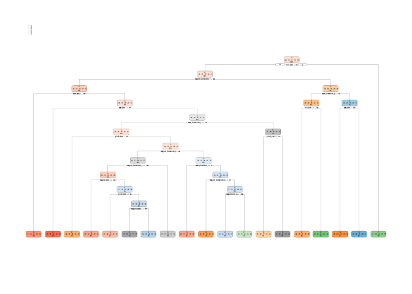

Prediction for the Weight Lifting Exercise.
===========================================

Overview
--------

In this assignment, we built the model to predict how well the excercise
is done based on data from accelerometers on the belt, forearm, arm, and
dumbell of 6 participants. They were asked to perform barbell lifts
correctly and incorrectly in 5 different ways.

Analysis
--------

Load libraries to be used in this analysis.

Read dumbbell exercise data and replace invalid data to ‘NA’.

    data <- read.csv('data/pml-training.csv', na.strings = c('', 'NA', '#DIV/0!'))
    quiz <- read.csv('data/pml-testing.csv', na.strings = c('', 'NA', '#DIV/0!'))

Find columns that have missing data. Remove columns whose 90% of data is
missing.

    set.seed(1234)
    data %>% sample_n(size = 1000) %>% vis_miss()

    na_count <- apply(data, 2, function(x){ sum(is.na(x)) })
    label <- names(na_count[na_count < 0.9 * length(data)])

    data <- data %>% select(any_of(label))
    quiz <- quiz %>% select(any_of(label))

Remove columns that are not related to classe for prediction.

    label <- label[!(label %in% 
      c(
        'X', 'user_name',
        'raw_timestamp_part_1', 'raw_timestamp_part_2', 
        'cvtd_timestamp', 'new_window', 'num_window'
      )
    )]

    data <- data %>% select(any_of(label))
    quiz <- quiz %>% select(any_of(label))

Remove the pair of columns with high correlation to reduce the
dimension.

    cor_matrix <- cor(data[!names(data) == 'classe'])
    corrplot(
      cor_matrix, 
      method = 'color', 
      type = 'lower', 
      order = 'hclust', 
      tl.cex = .90, 
      tl.col = 'black'
    )

    low_cor_index <- findCorrelation(cor_matrix, cutoff = .70, exact = TRUE)

    data <- data %>% select(c(label[low_cor_index], 'classe'))
    quiz <- quiz %>% select(label[low_cor_index])

Review cleaned data.

    summary(data)

    ##   accel_belt_z       roll_belt       accel_belt_y     accel_arm_y    
    ##  Min.   :-275.00   Min.   :-28.90   Min.   :-69.00   Min.   :-318.0  
    ##  1st Qu.:-162.00   1st Qu.:  1.10   1st Qu.:  3.00   1st Qu.: -54.0  
    ##  Median :-152.00   Median :113.00   Median : 35.00   Median :  14.0  
    ##  Mean   : -72.59   Mean   : 64.41   Mean   : 30.15   Mean   :  32.6  
    ##  3rd Qu.:  27.00   3rd Qu.:123.00   3rd Qu.: 61.00   3rd Qu.: 139.0  
    ##  Max.   : 105.00   Max.   :162.00   Max.   :164.00   Max.   : 308.0  
    ##  total_accel_belt    yaw_belt       accel_dumbbell_z   accel_belt_x     
    ##  Min.   : 0.00    Min.   :-180.00   Min.   :-334.00   Min.   :-120.000  
    ##  1st Qu.: 3.00    1st Qu.: -88.30   1st Qu.:-142.00   1st Qu.: -21.000  
    ##  Median :17.00    Median : -13.00   Median :  -1.00   Median : -15.000  
    ##  Mean   :11.31    Mean   : -11.21   Mean   : -38.32   Mean   :  -5.595  
    ##  3rd Qu.:18.00    3rd Qu.:  12.90   3rd Qu.:  38.00   3rd Qu.:  -5.000  
    ##  Max.   :29.00    Max.   : 179.00   Max.   : 318.00   Max.   :  85.000  
    ##    pitch_belt       magnet_dumbbell_x accel_dumbbell_y  magnet_dumbbell_y
    ##  Min.   :-55.8000   Min.   :-643.0    Min.   :-189.00   Min.   :-3600    
    ##  1st Qu.:  1.7600   1st Qu.:-535.0    1st Qu.:  -8.00   1st Qu.:  231    
    ##  Median :  5.2800   Median :-479.0    Median :  41.50   Median :  311    
    ##  Mean   :  0.3053   Mean   :-328.5    Mean   :  52.63   Mean   :  221    
    ##  3rd Qu.: 14.9000   3rd Qu.:-304.0    3rd Qu.: 111.00   3rd Qu.:  390    
    ##  Max.   : 60.3000   Max.   : 592.0    Max.   : 315.00   Max.   :  633    
    ##   accel_arm_x      accel_dumbbell_x   accel_arm_z       magnet_arm_y   
    ##  Min.   :-404.00   Min.   :-419.00   Min.   :-636.00   Min.   :-392.0  
    ##  1st Qu.:-242.00   1st Qu.: -50.00   1st Qu.:-143.00   1st Qu.:  -9.0  
    ##  Median : -44.00   Median :  -8.00   Median : -47.00   Median : 202.0  
    ##  Mean   : -60.24   Mean   : -28.62   Mean   : -71.25   Mean   : 156.6  
    ##  3rd Qu.:  84.00   3rd Qu.:  11.00   3rd Qu.:  23.00   3rd Qu.: 323.0  
    ##  Max.   : 437.00   Max.   : 235.00   Max.   : 292.00   Max.   : 583.0  
    ##  magnet_belt_z    accel_forearm_y  gyros_forearm_z    gyros_dumbbell_x   
    ##  Min.   :-623.0   Min.   :-632.0   Min.   : -8.0900   Min.   :-204.0000  
    ##  1st Qu.:-375.0   1st Qu.:  57.0   1st Qu.: -0.1800   1st Qu.:  -0.0300  
    ##  Median :-320.0   Median : 201.0   Median :  0.0800   Median :   0.1300  
    ##  Mean   :-345.5   Mean   : 163.7   Mean   :  0.1512   Mean   :   0.1611  
    ##  3rd Qu.:-306.0   3rd Qu.: 312.0   3rd Qu.:  0.4900   3rd Qu.:   0.3500  
    ##  Max.   : 293.0   Max.   : 923.0   Max.   :231.0000   Max.   :   2.2200  
    ##  gyros_dumbbell_z   gyros_arm_x       classe  
    ##  Min.   : -2.380   Min.   :-6.37000   A:5580  
    ##  1st Qu.: -0.310   1st Qu.:-1.33000   B:3797  
    ##  Median : -0.130   Median : 0.08000   C:3422  
    ##  Mean   : -0.129   Mean   : 0.04277   D:3216  
    ##  3rd Qu.:  0.030   3rd Qu.: 1.57000   E:3607  
    ##  Max.   :317.000   Max.   : 4.87000

Separate data to training/testing for cross validation.

    inTrain <- createDataPartition(y = data$classe, p = 0.75, list = FALSE)
    training <- data[inTrain,]
    testing <- data[-inTrain,]

Train the model with decision tree. Calculate the accuracy of this model
and it’s 0.676.

    rp_model <- rpart(classe ~ ., data = training, method = 'class')
    rp_pred <- predict(rp_model, testing, type = 'class')

    (rp_cm <- table(rp_pred, testing$classe))

    ##        
    ## rp_pred    A    B    C    D    E
    ##       A 1127  151  136  108   73
    ##       B   45  568   59   32   38
    ##       C   72   92  547  134  126
    ##       D  104  111  113  497   86
    ##       E   47   27    0   33  578

    sum(diag(rp_cm))/sum(rp_cm)

    ## [1] 0.6763866

    rpart.plot(rp_model)

Train the model with random forest. Calculate the accuracy of this model
and it’s 0.987. Based on the plot, important variables are roll\_belt,
yaw\_belt and pitch\_belt.

    rf_model <- randomForest(
        x = training[names(training) != 'classe'],
        y = training$classe,
        xtest = testing[names(testing) != 'classe'],
        ytest = testing$classe,
        keep.forest = TRUE
    )
    rf_model$confusion

    ##      A    B    C    D    E class.error
    ## A 4165    7    6    6    1 0.004778973
    ## B   32 2795   20    1    0 0.018609551
    ## C    9   24 2526    8    0 0.015971952
    ## D    5    0   35 2369    3 0.017827529
    ## E    0    8    4    9 2685 0.007760532

    sum(diag(rf_model$confusion)/sum(rf_model$confusion))

    ## [1] 0.9879016

    varImpPlot(rf_model)

Check if PCA will improve the accuracy of model. PC1 ~ PC11 explain
about .975.

    pca_data <- prcomp(data[names(data) != 'classe'], center = TRUE, scale = TRUE)
    summary(pca_data)

    ## Importance of components:
    ##                           PC1    PC2    PC3    PC4     PC5     PC6     PC7
    ## Standard deviation     2.4569 2.0725 1.6992 1.5067 1.15637 1.10860 1.01339
    ## Proportion of Variance 0.2744 0.1953 0.1312 0.1032 0.06078 0.05586 0.04668
    ## Cumulative Proportion  0.2744 0.4696 0.6008 0.7040 0.76482 0.82068 0.86736
    ##                            PC8     PC9    PC10    PC11    PC12   PC13    PC14
    ## Standard deviation     0.89805 0.82730 0.70593 0.61908 0.42376 0.2891 0.25520
    ## Proportion of Variance 0.03666 0.03111 0.02265 0.01742 0.00816 0.0038 0.00296
    ## Cumulative Proportion  0.90402 0.93513 0.95778 0.97520 0.98337 0.9872 0.99013
    ##                           PC15    PC16   PC17    PC18    PC19    PC20    PC21
    ## Standard deviation     0.23418 0.21108 0.1815 0.16648 0.16085 0.13056 0.10415
    ## Proportion of Variance 0.00249 0.00203 0.0015 0.00126 0.00118 0.00077 0.00049
    ## Cumulative Proportion  0.99262 0.99464 0.9961 0.99740 0.99858 0.99935 0.99984
    ##                           PC22
    ## Standard deviation     0.05850
    ## Proportion of Variance 0.00016
    ## Cumulative Proportion  1.00000

Built random forest with PCA data. PCA data doesn’t improve the
accuracy.

    pca_data <- data.frame(classe = data$classe, pca_data$x)
    pca_data <- pca_data[,1:11]

    inTrain <- createDataPartition(y = pca_data$classe, p = 0.75, list = FALSE)
    pca_training <- pca_data[inTrain,]
    pca_testing <- pca_data[-inTrain,]

    pca_rf_model <- randomForest(
        x = pca_training[names(pca_training) != 'classe'],
        y = pca_training$classe,
        xtest = pca_testing[names(pca_testing) != 'classe'],
        ytest = pca_testing$classe,
        keep.forest = TRUE
    )

    pca_rf_model$confusion

    ##      A    B    C    D    E class.error
    ## A 4004   41   58   71   11  0.04324970
    ## B  119 2593   86   39   11  0.08953652
    ## C   60   69 2386   44    8  0.07051032
    ## D   72   20  135 2166   19  0.10199005
    ## E   20   32   35   31 2588  0.04360680

    sum(diag(pca_rf_model$confusion)/sum(pca_rf_model$confusion))

    ## [1] 0.9333248

Conclusion
----------

RandomForest with raw dataset has highest accuracy among models we built
to predict how well the excercise is done. Predict quiz data with the
model.

    predict(rf_model, newdata = quiz)

    ##  1  2  3  4  5  6  7  8  9 10 11 12 13 14 15 16 17 18 19 20 
    ##  B  A  B  A  A  E  D  B  A  A  B  C  B  A  E  E  A  B  B  B 
    ## Levels: A B C D E
